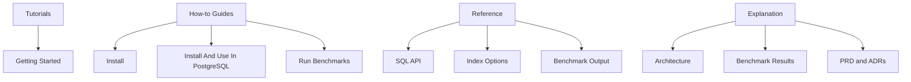

# Documentation

This documentation follows the Diataxis model so readers can choose the right level of detail quickly.

## Tutorials

- [Getting started](tutorials/getting-started.md)

## How-to guides

- [Install the extension](how-to/install.md)
- [Install and use it in PostgreSQL](how-to/install-and-use-in-postgres.md)
- [Run the benchmark suite](how-to/run-benchmarks.md)

## Reference

- [SQL API](reference/sql-api.md)
- [Index options](reference/index-options.md)
- [Benchmark output schema](reference/benchmark-output.md)

## Explanation

- [Architecture](explanation/architecture.md)
- [Benchmark results](explanation/benchmark-results.md)
- [PRD](PRD.md)
- [ADRs](adrs)
