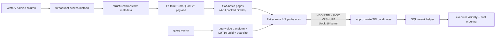

# Architecture

`pg_turboquant` is a dedicated PostgreSQL access method, not an opclass layered onto another ANN index. That choice drives the rest of the design.

## Why a dedicated access method

The project needs direct control over:

- page layout
- batch packing
- codec choice
- scan behavior
- planner hooks
- WAL-localized mutation helpers

That is why the design lives under `USING turboquant` instead of trying to fit a different physical model into pgvector's existing access methods.

## Core design decisions

- storage is page-budget driven, so lane count is derived rather than assumed
- structured transforms are persisted as compact metadata, not dense matrices
- the primary packed path is faithful TurboQuant `v2` for normalized cosine/IP
- fixed-width metadata and covering payloads live beside the ANN key instead of forcing stage-1 heap visits
- exact reranking is a SQL concern, not an access-method concern
- write churn is absorbed by a built-in delta tier plus lightweight maintenance / merge helpers
- v1 uses generic WAL, localized behind helper code

## Codec

The v2 codec implements the paper-faithful TurboQuant `Qprod` construction:

- structured rotation (Hadamard) maps the input vector into a transform space
- `b - 1` stage-1 scalar codes quantize each subvector
- a residual 1-bit QJL (Johnson-Lindenstrauss) sketch captures sign information lost by scalar quantization
- a per-vector `gamma = ||r||_2` (float32 residual norm) is stored alongside the codes

This payload enables an unbiased inner-product estimator that operates directly on the quantized codes without decoding.

### LUT16 quantization

For the SIMD fast path (bits=4, dimension divisible by 8), the 3-bit idx code and 1-bit QJL sign are combined into a 4-bit nibble, enabling 16-entry lookup tables. At scan time:

- `tq_prod_lut16_build` constructs 16-entry float LUTs per dimension from the query-dependent `Qprod` lookup tables
- `tq_prod_lut16_quantize` quantizes all LUT entries to int8 using a **single global scale** per component (base and QJL), enabling pure integer accumulation across all dimensions without per-dimension float conversion

## Page format

Batch pages support two layouts, selected automatically at index build time:

- **SoA (Structure of Arrays)**: used when LUT16 is supported and the layout fits in the page. Stores a contiguous TID array, gamma array, and a 4-bit packed dimension-major nibble block (two candidates per byte). A single representative packed code is stored at the end for page pruning bounds. The SIMD kernel reads nibbles directly from the page buffer with no intermediate copy.
- **AoS (Array of Structures)**: legacy interleaved layout with per-lane TID + packed code entries. Used for dimensions that don't support LUT16 (not divisible by 8) or when the SoA layout exceeds the page budget (e.g., dim > ~480 after Hadamard padding with 16 lanes).

## Scan model

There are two principal query paths:

- flat mode:
  scan all TurboQuant batch pages with a bounded candidate heap
- IVF mode:
  route to a subset of lists using `turboquant.probes`

Within those paths there are two scoring modes:

- **code-domain fast path** (`score_mode = 'code_domain'`):
  normalized cosine and inner-product queries score directly on the quantized Qprod payload without decoding vectors. This is the faithful fast path. When the page uses SoA format with block-16 SIMD support, scoring uses the zero-copy kernel that reads 4-bit packed nibbles directly from the page buffer.
- **decode-score fallback** (`score_mode = 'decode_score'`):
  L2 and non-normalized scans decode vectors from the stored codes and compute exact distances. This path does not claim faithful TurboQuant semantics.

### SIMD kernels

The block-16 scoring kernel processes 16 candidates per dimension in parallel:

- **NEON (arm64)**: `vqtbl1q_u8` (TBL) for 16-wide lookup from quantized int8 LUT, `vaddw_s8` for add-widening accumulation in int16, drain to int32 every 256 dimensions
- **AVX2 (x86_64)**: `_mm_shuffle_epi8` (VPSHUFB) for equivalent lookup, `_mm_add_epi16` for int16 accumulation, drain via `_mm256_cvtepi16_epi32`
- **Scalar**: reference implementation using int32 accumulators

All kernels apply the global dequantization scale only once after all dimensions are processed. The scalar path is the source of truth; SIMD kernels are validated against it.

### Scan orchestration

IVF scans additionally select a scan orchestration:

- `ivf_bounded_pages`: page-visit budget limits work; page summaries enable safe pruning of pages whose bounds cannot beat the current candidate heap threshold
- `ivf_near_exhaustive`: when the selected probe set covers more than ~70% of the index, the scan switches to a near-exhaustive strategy

Filtered workloads can also use the bitmap path with `tq_bitmap_cosine_filter()`, but ordered ANN scans remain the main retrieval surface. The current fixed-width metadata plane supports exact filters over `bool`, `int2`, `int4`, `int8`, `date`, `timestamptz`, and `uuid`, with the narrow int4 fast lane also supporting `ANY(int4[])` inside the ordered ANN path.

## Operational boundary

The extension is intentionally honest about what it does not support yet:

- no internal heap reranking
- no varlena / text metadata predicates inside the ANN path
- no parallel scan or parallel vacuum path
- no maintenance-work-mem-aware build / maintenance contract yet

Those boundaries are surfaced in `tq_index_metadata(...)` and in the benchmark suite output instead of being left implicit.
