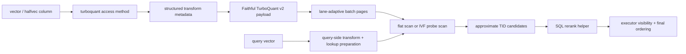

# Architecture

`pg_turboquant` is a dedicated PostgreSQL access method, not an opclass layered onto another ANN index. That choice drives the rest of the design.

## Why a dedicated access method

The project needs direct control over:

- page layout
- batch packing
- codec choice
- scan behavior
- planner hooks
- WAL-localized mutation helpers

That is why the design lives under `USING turboquant` instead of trying to fit a different physical model into pgvector's existing access methods.

## Core design decisions

- storage is page-budget driven, so lane count is derived rather than assumed
- structured transforms are persisted as compact metadata, not dense matrices
- the primary packed path is faithful TurboQuant `v2` for normalized cosine/IP
- exact reranking is a SQL concern, not an access-method concern
- v1 mutation rules are append-only plus dead-bit cleanup
- v1 uses generic WAL, localized behind helper code

## Codec

The v2 codec implements the paper-faithful TurboQuant `Qprod` construction:

- structured rotation (Hadamard) maps the input vector into a transform space
- `b - 1` stage-1 scalar codes quantize each subvector
- a residual 1-bit QJL (Johnson-Lindenstrauss) sketch captures sign information lost by scalar quantization
- a per-vector `gamma = ||r||_2` (float32 residual norm) is stored alongside the codes

This payload enables an unbiased inner-product estimator that operates directly on the quantized codes without decoding.

## Scan model

There are two principal query paths:

- flat mode:
  scan all TurboQuant batch pages with a bounded candidate heap
- IVF mode:
  route to a subset of lists using `turboquant.probes`

Within those paths there are two scoring modes:

- **code-domain fast path** (`score_mode = 'code_domain'`):
  normalized cosine and inner-product queries score directly on the quantized Qprod payload without decoding vectors. This is the faithful fast path.
- **decode-score fallback** (`score_mode = 'decode_score'`):
  L2 and non-normalized scans decode vectors from the stored codes and compute exact distances. This path does not claim faithful TurboQuant semantics.

IVF scans additionally select a scan orchestration:

- `ivf_bounded_pages`: page-visit budget limits work; page summaries enable safe pruning of pages whose bounds cannot beat the current candidate heap threshold
- `ivf_near_exhaustive`: when the selected probe set covers more than ~70% of the index, the scan switches to a near-exhaustive strategy

Filtered workloads can also use the bitmap path with `tq_bitmap_cosine_filter()`, but ordered ANN scans remain the main retrieval surface.

## Operational boundary

The extension is intentionally honest about what it does not support yet:

- no index-only scans
- no multicolumn support
- no `INCLUDE` support
- no internal heap reranking

Those boundaries are surfaced in `tq_index_metadata(...)` and in the benchmark suite output instead of being left implicit.
