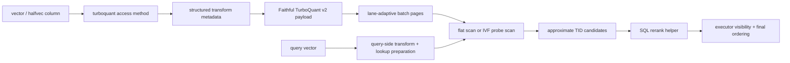

# Architecture

`pg_turboquant` is a dedicated PostgreSQL access method, not an opclass layered onto another ANN index. That choice drives the rest of the design.

## Why a dedicated access method

The project needs direct control over:

- page layout
- batch packing
- codec choice
- scan behavior
- planner hooks
- WAL-localized mutation helpers

That is why the design lives under `USING turboquant` instead of trying to fit a different physical model into pgvector's existing access methods.

## Core design decisions

- storage is page-budget driven, so lane count is derived rather than assumed
- structured transforms are persisted as compact metadata, not dense matrices
- the primary packed path is faithful TurboQuant `v2` for normalized cosine/IP
- exact reranking is a SQL concern, not an access-method concern
- v1 mutation rules are append-only plus dead-bit cleanup
- v1 uses generic WAL, localized behind helper code

## Scan model

There are two principal query paths:

- flat mode:
  scan all TurboQuant batch pages with a bounded candidate heap
- IVF mode:
  route to a subset of lists using `turboquant.probes`

Within those paths there are also two scoring modes:

- faithful fast path:
  normalized cosine and inner product stay in code domain using paper-faithful `Qprod`: `b - 1` stage-1 codes, residual 1-bit QJL sketch bits, and stored residual norm `gamma`
- compatibility fallback:
  L2 and non-normalized scans decode vectors and score them explicitly

Filtered workloads can also use the bitmap path, but ordered ANN scans remain the main retrieval surface.

Current page summaries are still a transitional heuristic. They are useful for ordering work, but faithful pruning must be rebuilt around same-space bounds before the project can claim mathematically safe pruning.

## Operational boundary

The extension is intentionally honest about what it does not support yet:

- no index-only scans
- no multicolumn support
- no `INCLUDE` support
- no internal heap reranking

Those boundaries are surfaced in `tq_index_metadata(...)` and in the benchmark suite output instead of being left implicit.
