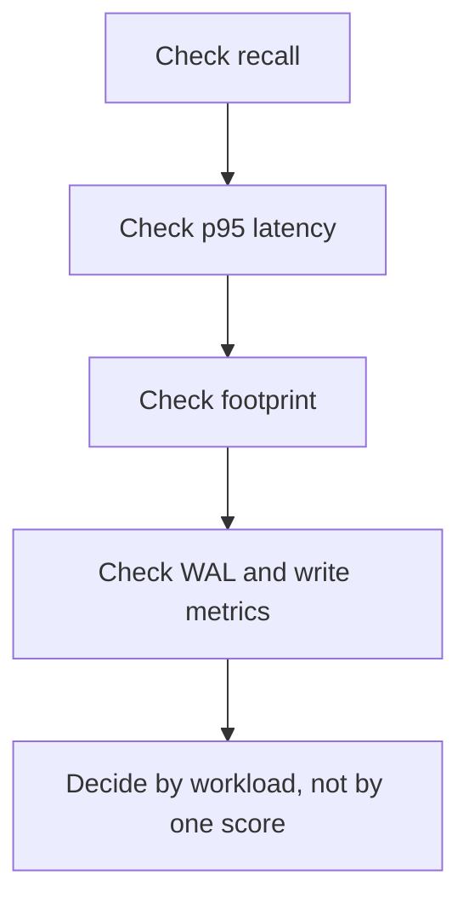

# Benchmark results

This page summarizes benchmark evidence from the current v2 Qprod/QJL codec on amd64. These numbers are informative, not universal. They depend on dataset, query shape, hardware, and benchmark configuration.

## What the results show

1. TurboQuant delivers 3-4x smaller index footprints than pgvector HNSW and IVFFlat across all tested datasets.
2. On flat-scan workloads (KILT NQ, PopQA), recall matches pgvector baselines and latency is competitive or faster.
3. On IVF workloads (HotpotQA), approximate recall is lower due to quantization loss. The rerank path recovers to full recall and is the fastest rerank option.
4. Latency is workload-dependent. TurboQuant is not the fastest option on every dataset or mode.

## Representative retrieval results

All results below are from a single amd64 run (PG 16, bge-small-en-v1.5, v2 Qprod/QJL codec, 200 queries per dataset). The benchmark adapter uses the same inline CTE query structure for all backends, with scan stats collection outside the timing window.

### KILT NQ (2.5K passages, flat scan)

| Method | Recall@10 | P95 Latency (ms) | Footprint |
|---|---:|---:|---:|
| `pg_turboquant_approx` | 0.950 | 2.6 | 1.2 MB |
| `pg_turboquant_rerank` | 0.950 | 2.7 | 1.2 MB |
| `pgvector_hnsw_approx` | 0.950 | 3.7 | 5.1 MB |
| `pgvector_hnsw_rerank` | 0.950 | 2.6 | 5.1 MB |
| `pgvector_ivfflat_approx` | 0.950 | 3.5 | 4.4 MB |
| `pgvector_ivfflat_rerank` | 0.950 | 2.8 | 4.4 MB |

Interpretation:

- Recall matches across all methods.
- TurboQuant approx is the fastest approx path (2.6ms vs 3.5-3.7ms).
- TurboQuant footprint is 4x smaller than pgvector baselines.

### KILT HotpotQA (10K passages, IVF scan)

| Method | Recall@10 | P95 Latency (ms) | Footprint |
|---|---:|---:|---:|
| `pg_turboquant_approx` | 0.363 | 4.6 | 6.2 MB |
| `pg_turboquant_rerank` | 1.000 | 6.8 | 6.2 MB |
| `pgvector_hnsw_approx` | 0.585 | 7.5 | 21.6 MB |
| `pgvector_hnsw_rerank` | 1.000 | 7.4 | 21.6 MB |
| `pgvector_ivfflat_approx` | 0.585 | 7.9 | 17.6 MB |
| `pgvector_ivfflat_rerank` | 1.000 | 7.4 | 17.6 MB |

Interpretation:

- TurboQuant approx recall (0.363) is lower than pgvector (0.585) due to quantization loss in code-domain scoring.
- The rerank path recovers all methods to recall 1.0.
- TurboQuant rerank (6.8ms) is the fastest rerank path.
- Footprint is 3.5x smaller.

### PopQA (4.9K passages, flat scan)

| Method | Recall@10 | P95 Latency (ms) | Footprint |
|---|---:|---:|---:|
| `pg_turboquant_approx` | 1.000 | 6.5 | 2.5 MB |
| `pg_turboquant_rerank` | 1.000 | 4.3 | 2.5 MB |
| `pgvector_hnsw_approx` | 1.000 | 6.5 | 10.0 MB |
| `pgvector_hnsw_rerank` | 1.000 | 4.4 | 10.0 MB |
| `pgvector_ivfflat_approx` | 1.000 | 6.4 | 8.2 MB |
| `pgvector_ivfflat_rerank` | 1.000 | 4.3 | 8.2 MB |

Interpretation:

- All methods match at recall 1.0.
- Latency is comparable across all methods.
- TurboQuant footprint is 3-4x smaller.

## How to read these results

Use these results as examples of the tradeoff shape, not as a promise that one method always wins. The benchmark harness keeps recall, latency, footprint, WAL, and concurrent-write measurements separate so tradeoffs remain visible.
