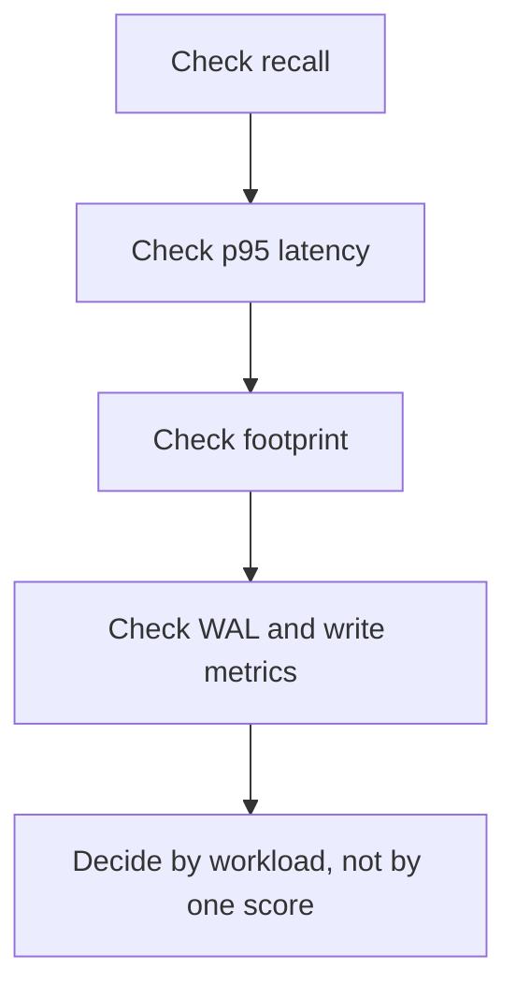

# Benchmark results

This page summarizes concrete benchmark evidence already committed in the repository. These numbers are informative, not universal. They depend on dataset, query shape, hardware, and benchmark configuration.

## What the results show

The evidence so far supports three broad claims:

1. TurboQuant can deliver much smaller index footprints than the pgvector baselines in this repository.
2. Recall can match the baselines on several committed runs when query knobs are tuned correctly.
3. Latency is workload-dependent. TurboQuant is not the fastest option on every dataset.

## Representative retrieval results

### KILT NQ small live

| Method | Recall@10 | P95 Latency (ms) | Footprint (bytes) |
|---|---:|---:|---:|
| `pg_turboquant_approx` | 0.946667 | 8.836190 | 1,277,952 |
| `pg_turboquant_rerank` | 0.946667 | 7.882409 | 1,277,952 |
| `pgvector_hnsw_approx` | 0.946667 | 28.845381 | 5,079,040 |
| `pgvector_hnsw_rerank` | 0.946667 | 11.197651 | 5,079,040 |
| `pgvector_ivfflat_approx` | 0.946667 | 49.492140 | 4,399,104 |
| `pgvector_ivfflat_rerank` | 0.946667 | 14.661624 | 4,399,104 |

Interpretation:

- TurboQuant matched the checked-in recall while using materially less space.
- On this dataset, TurboQuant also beat both pgvector baselines on retrieval p95 latency.

### PopQA mini

| Method | Recall@10 | P95 Latency (ms) | Footprint (bytes) |
|---|---:|---:|---:|
| `pg_turboquant_approx` | 1.000000 | 10.058850 | 24,576 |
| `pg_turboquant_rerank` | 1.000000 | 4.796433 | 24,576 |
| `pgvector_hnsw_approx` | 1.000000 | 3.707408 | 73,728 |
| `pgvector_hnsw_rerank` | 1.000000 | 5.408724 | 73,728 |
| `pgvector_ivfflat_approx` | 1.000000 | 4.293900 | 81,920 |
| `pgvector_ivfflat_rerank` | 1.000000 | 5.975884 | 81,920 |

Interpretation:

- All methods matched recall in this committed run.
- TurboQuant kept the smallest footprint by a wide margin.
- Approximate latency was slower than the pgvector baselines, but the rerank mode remained competitive.

### HotpotQA fixed-q50

| Method | Recall@10 | P95 Latency (ms) | Footprint (bytes) |
|---|---:|---:|---:|
| `pg_turboquant_approx` | 1.000000 | 64.991898 | 5,873,664 |
| `pg_turboquant_rerank` | 1.000000 | 117.696125 | 5,873,664 |
| `pgvector_hnsw_approx` | 0.980000 | 31.448821 | 21,553,152 |
| `pgvector_hnsw_rerank` | 1.000000 | 34.488525 | 21,553,152 |
| `pgvector_ivfflat_approx` | 1.000000 | 8.329492 | 17,563,648 |
| `pgvector_ivfflat_rerank` | 1.000000 | 18.840217 | 17,563,648 |

Interpretation:

- TurboQuant again kept the smallest footprint.
- Recall stayed competitive.
- Latency was clearly worse than pgvector IVFFlat on this workload.

## Tuning evidence

The checked-in planner-tuning evidence recorded the following on a medium IVF run over `normalized_dense`:

- `turboquant.probes = 1`
  - `candidate_slots_bound = 4`
  - `recall_at_10 = 0.291667`
- `turboquant.probes = 4`
  - `candidate_slots_bound = 16`
  - `recall_at_10 = 0.733333`

That is the intended tradeoff surface: more probes can improve recall, but the candidate budget and scan work rise with it.

## WAL and write amplification

The repository also contains benchmark evidence for WAL reduction after the compact occupied-prefix batch-page layout landed. The exact deltas are workload-specific, so the benchmark suite records them as explicit fields rather than folding them into a narrative claim.

## How to read these results

Use these results as examples of the tradeoff shape, not as a promise that one method always wins.
