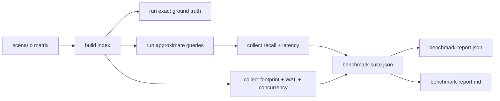

# Run the benchmark suite

Use the benchmark suite to measure recall, latency, build cost, footprint, WAL, and concurrent-write behavior. Keep those metrics separate; the project does not treat one scalar score as a truthful summary.

## 1. Start with a dry run

This validates the scenario matrix and output schema without requiring a live PostgreSQL instance:

```sh
uv run python scripts/benchmark_suite.py \
  --dry-run \
  --profile tiny \
  --corpus normalized_dense,clustered \
  --methods turboquant_flat,turboquant_ivf,turboquant_bitmap,pgvector_ivfflat,pgvector_hnsw \
  --report \
  --output benchmark-suite.json
```

## 2. Run against PostgreSQL

With PostgreSQL running locally and both extensions installed:

```sh
uv run python scripts/benchmark_suite.py \
  --host 127.0.0.1 \
  --port 5432 \
  --dbname postgres \
  --profile medium \
  --corpus normalized_dense,clustered,mixed_live_dead \
  --methods turboquant_flat,turboquant_ivf,turboquant_bitmap,pgvector_ivfflat,pgvector_hnsw \
  --report \
  --output benchmark-suite.json
```

## 3. Tune IVF probes explicitly

```sh
uv run python scripts/benchmark_suite.py \
  --host 127.0.0.1 \
  --port 5432 \
  --dbname postgres \
  --profile medium \
  --corpus normalized_dense \
  --methods turboquant_ivf \
  --turboquant-probes 4 \
  --output planner-high.json
```

The suite records `turboquant.probes`, `turboquant.oversample_factor`, and the derived `candidate_slots_bound` so probe experiments are reproducible.

## Output artifacts

- main JSON output
- `benchmark-report.json`
- `benchmark-report.md`



## What to look at first

- `metrics.recall_at_10`
- `metrics.p95_ms`
- `metrics.index_size_bytes`
- `metrics.build_wal_bytes`
- `metrics.concurrent_insert_rows_per_second`
- `index_metadata.capabilities`
- `simd.selected_kernel`

## RAG benchmarks

The repository also carries a higher-level benchmark harness under `benchmarks/rag/`. That layer compares `pg_turboquant`, pgvector HNSW, and pgvector IVFFlat under retrieval-only and fixed-generator RAG scenarios.
