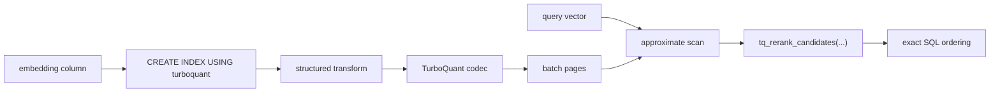

# Getting Started

This tutorial walks through the shortest useful path: build the extension, install it in PostgreSQL, create a TurboQuant index, and run an ANN query with SQL-side reranking.

## 1. Build the extension

From the repository root:

```sh
make
make install
```

You need a PostgreSQL server development toolchain with PGXS, plus `pgvector` available in the target database.

## 2. Enable the extensions

Connect to a database and run:

```sql
CREATE EXTENSION vector;
CREATE EXTENSION pg_turboquant;
```

## 3. Create a table with embeddings

```sql
CREATE TABLE docs (
  id bigint PRIMARY KEY,
  title text NOT NULL,
  embedding vector(4) NOT NULL
);

INSERT INTO docs (id, title, embedding) VALUES
  (1, 'alpha', '[1,0,0,0]'),
  (2, 'beta',  '[0.8,0.2,0,0]'),
  (3, 'gamma', '[0,1,0,0]');
```

## 4. Build a TurboQuant index

```sql
CREATE INDEX docs_embedding_tq_idx
ON docs
USING turboquant (embedding tq_cosine_ops)
WITH (
  bits = 4,
  lists = 0,
  transform = 'hadamard',
  normalized = true
);
```

Start with `lists = 0` for a flat index. Move to IVF later when the corpus is large enough to justify routing.

## 5. Query through the supported helper

```sql
SELECT *
FROM tq_rerank_candidates(
  'docs'::regclass,
  'id',
  'embedding',
  '[1,0,0,0]'::vector(4),
  'cosine',
  20,
  5
);
```

This keeps approximate retrieval inside the index and exact reranking in SQL, which is the intended architectural boundary for v1.

## 6. Inspect the index

```sql
SELECT tq_index_metadata('docs_embedding_tq_idx'::regclass);
```

That JSON payload exposes format version, codec, transform metadata, list counts, live/dead counts, capability flags, and maintenance recommendations.

## What just happened



Next steps:

- If you need installation detail, go to [../how-to/install.md](../how-to/install.md).
- If you need tuning or measurement, go to [../how-to/run-benchmarks.md](../how-to/run-benchmarks.md).
- If you need the full function and reloption surface, go to [../reference/sql-api.md](../reference/sql-api.md).
